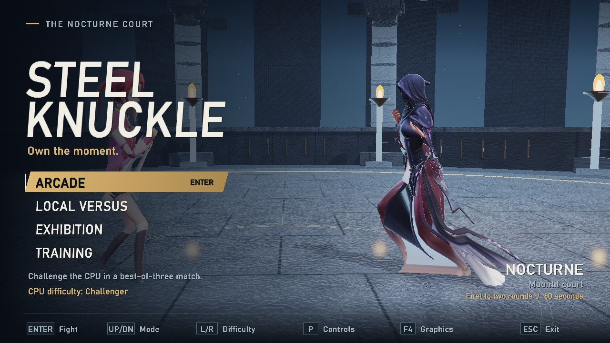
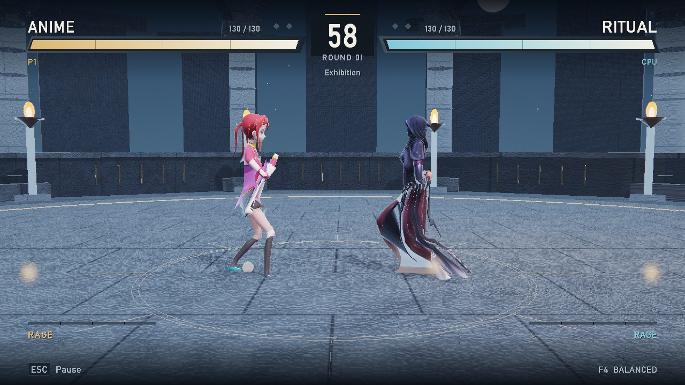
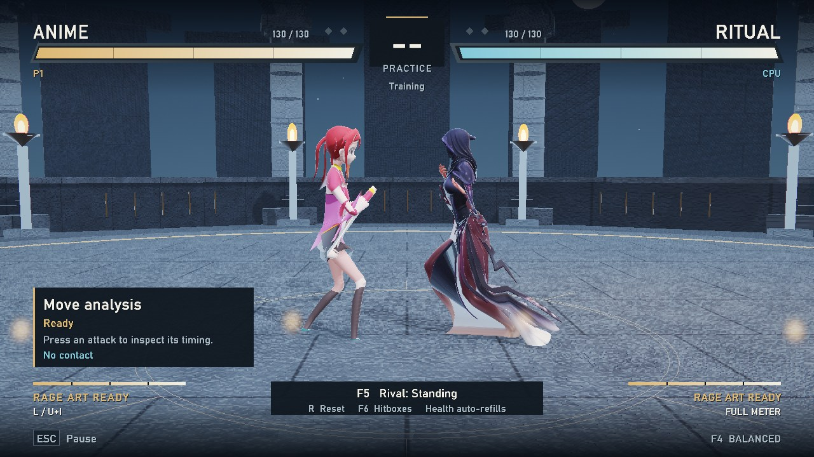
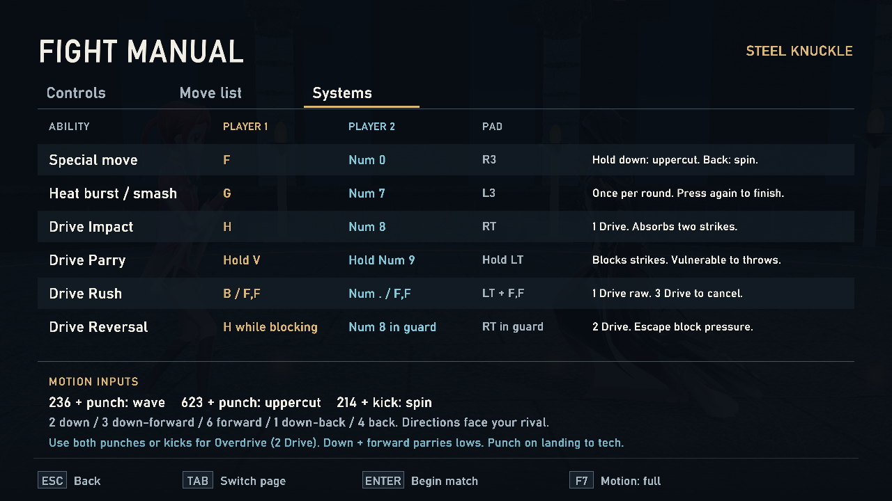
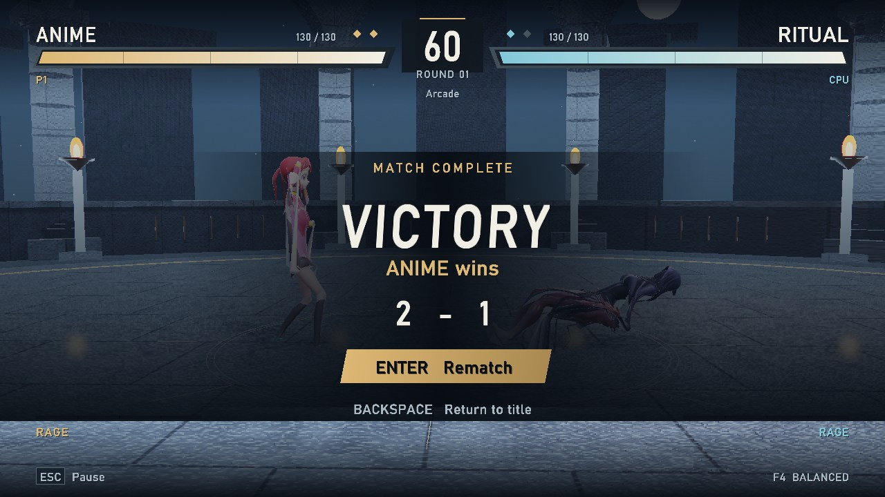

<div align="center">

# STEEL KNUCKLE

**Own the moment.**

A 3D fighting game written from scratch in C++17. SDL3 handles the window, input and audio;
[Diligent Engine](https://github.com/DiligentGraphics/DiligentCore) renders it on OpenGL or
Vulkan. Sidesteps and limb strings on one side, motion-command specials and a six-stock Drive
gauge on the other. Every move and every number in it is original.




[Screenshots](#screenshots) · [Combat](#combat-systems) · [Controls](#controls) ·
[Build](#build) · [Tests](#tests) · [Layout](#project-layout)

</div>

---

## The game

Two fighters, one moonlit court. Best of three, sixty seconds a round.

Movement is 3D. Sidesteps carry you into the background and foreground, and projectiles travel a
fixed line, so stepping off that line beats one outright. Over the top of that footwork sits a
motion-command layer: quarter circles, dragon punches, Overdrive versions, and two meters built to
punish hoarding.

Four modes on the title screen. Arcade runs a best-of-three against the CPU at one of three
difficulties, Rookie through Veteran. Local Versus and Exhibition cover two players and free play.
Training adds a move-analysis panel: startup, active and recovery frames for whatever you just
pressed, whether it hit, got blocked or got parried, and the frame advantage you kept.

## Screenshots

<table>
<tr>
<td width="50%"><br>
<sub>Neutral: health, round pips, Rage meters, side-on tracking camera.</sub></td>
<td width="50%"><br>
<sub>Training, with dummy states on F5 and hitboxes on F6.</sub></td>
</tr>
<tr>
<td><br>
<sub>The fight manual: controls, move list, systems. Tab pages through it.</sub></td>
<td><br>
<sub>Match over. Enter rematches, Backspace returns to the title.</sub></td>
</tr>
</table>

## Combat systems

| System | Cost | What it does |
|---|---|---|
| **Specials** | — | `236`+punch Palm Wave, `623`+punch Rising Fang, `214`+kick Cyclone Kick. A shortcut button fires the neutral, down or back version without the motion. |
| **Overdrive** | 2 Drive | Hold an attack button with the shortcut, or use both punches or both kicks, to upgrade a special. |
| **Drive Impact** | 1 Drive | Eats two strikes through startup and active frames. A third strike or a throw beats it. |
| **Drive Parry** | Hold | Stops highs, mids, lows and projectiles. Throws beat it. The first two frames are a Perfect Parry; releasing costs 16 frames of recovery. |
| **Drive Rush** | 1 raw / 3 cancel | Closes distance. The next cancelable normal gains four frames of hitstun and blockstun. |
| **Drive Reversal** | 2 Drive | Escapes blockstun with strike-invulnerable startup, then leaves a vulnerable gap. |
| **Burnout** | — | Spend the last stock and Drive locks out for ten seconds, blockstun stretches, and special chip can kill. |
| **Heat** | Once a round | Heat Burst starts a ten-second timer. Power Straight on a grounded opponent starts a fifteen-second Engager. Heat chip comes back as recoverable grey health. |
| **Rage Art** | Low health | Charged finisher. A connecting special cancels into it. |

Juggles run on damage scaling and rising gravity, so no launcher keeps an opponent airborne
forever. Back plus left kick is Tornado Heel, worth one extension per airborne combo. Tap
down-forward to low-parry. Press punch or sidestep just before landing to tech.

Cancel windows and frame counts live in [`steel_knuckle/COMBAT.md`](steel_knuckle/COMBAT.md). The
pause menu carries the same manual in-game.

## Controls

| Action | Player 1 | Player 2 | Pad |
|---|---|---|---|
| Move / jump / crouch | `A` `D` / `W` / `S` | Arrow keys | Left stick |
| Sidestep | `Q` `E` | `,` `.` | — |
| Punches | `U` `I` | Numpad `4` `5` | Face buttons |
| Kicks | `J` `K` | Numpad `1` `2` | Face buttons |
| Throw / Rage Art | `O` / `L` | Numpad `6` / `3` | — |
| Special shortcut | `F` | Numpad `0` | R3 |
| Heat Burst / Smash | `G` | Numpad `7` | L3 |
| Drive Impact | `H` | Numpad `8` | RT |
| Drive Parry | Hold `V` | Hold Numpad `9` | Hold LT |
| Drive Rush | `B` or double forward | Numpad `.` or double forward | LT + forward, forward |
| Pause / manual | `Esc` or `P` | `Esc` or `P` | Start |

Directions face the opponent. Motion notation is numpad: `2` down, `3` down-forward, `6` forward,
`1` down-back, `4` back. A command has 22 simulation frames to finish, and the attack has to land
within six frames of the last direction.

Function keys work any time: `F1` mode, `F2` difficulty, `F3` post-processing, `F4` quality,
`F7` reduced motion. Training adds `F5` for the dummy state, `F6` for hitboxes and `R` to reset.

## Build

### Prerequisites

Two SDKs are too big to vendor here. Drop them under `third_party/` before configuring:

| Dependency | Where it goes | Notes |
|---|---|---|
| [DiligentCore](https://github.com/DiligentGraphics/DiligentCore) | `third_party/DiligentCore` | Clone it with submodules; CMake builds it from source. The Direct3D backends are switched off, because this toolchain is MinGW. |
| [SDL3 MinGW devel package](https://github.com/libsdl-org/SDL/releases) | `third_party/SDL3-3.4.16` | CMake looks for `x86_64-w64-mingw32/include/SDL3/SDL.h` under it. |

You also need CMake 3.19 or newer and a MinGW-w64 GCC toolchain. Keep the SDKs somewhere else if
you like and pass `-DTHIRD_PARTY=/path/to/sdks`. `ufbx` and `stb_image` are already in the tree.

### Configure and build

```sh
cmake -S steel_knuckle -B build/game -G "MinGW Makefiles"
cmake --build build/game --target steel_knuckle -j 4
```

`SDL3.dll` and an `assets/` folder get copied next to the executable during the build, so the game
runs from any working directory. Release builds compile at `-O1`. GCC 9 and newer miscompile parts
of Diligent at `-O2` and above; the engine's own build drops to `-O1` for the same reason.

### Run

```sh
build/game/steel_knuckle.exe
```

| Flag | Effect |
|---|---|
| `--demo` | CPU versus CPU from the first frame |
| `--training` | Boot straight into training |
| `--opengl` / `--vulkan` | Pick the backend (OpenGL is the default) |
| `--quality 0\|1\|2` | Performance, balanced, cinematic |
| `--nofx` | Start with post-processing off |
| `--size W H` | Window size |
| `--assets DIR` | Load models from somewhere other than `assets/` |
| `--shot N` | Write `shot.png` on frame N and exit |

## Tests

```sh
powershell -File steel_knuckle/tests/check.ps1
```

The harness borrows the compiler and include flags out of `build/game`, so configure the game
once first. It compiles `build/combat_tests.exe` against `game.cpp` and runs the simulation suite:
frame data, cancel windows, Drive and Heat accounting, juggle scaling. Add `-BuildGame` to build
the game afterwards.

## Project layout

```
steel_knuckle/
  src/
    main.cpp        window, backend selection, frame loop, global hotkeys
    game.cpp/.h     the simulation: frame data, Drive, Heat, juggles, CPU
    render.cpp/.h   Diligent device, render passes, post-processing
    scene.cpp       arena geometry, lighting, camera
    character.cpp   FBX skinning and pose blending
    meshgen.cpp     procedural meshes
    ui.cpp          HUD, title screen, pause manual, training readout
    font.cpp        bitmap text
    audio.cpp       synthesized SFX, 22 kHz, 12 voices
    platform.cpp    SDL3 window, input, timing
    shaders.h       shader sources compiled at startup
  tests/            combat simulation suite and check.ps1
  *.fbx, 91-anime_character/    character models and texture atlas
third_party/
  ufbx/  stb/       vendored single-file loaders
3d fighter.cpp      the earlier single-file raylib prototype, kept for reference
```

`build/`, `third_party/DiligentCore` and `third_party/SDL3-3.4.16` are git-ignored.

## Notes

- OpenGL is the default backend because it builds anywhere the MinGW toolchain does. Vulkan is one
  flag away.
- Models load through `ufbx` and textures through `stb_image`. Skinning and pose blending run on
  the CPU in `character.cpp`.
- No audio files ship with the game. Impacts, whiffs and menu clicks are synthesized at startup.
- The simulation runs on fixed frames. That is what makes both the test suite and the `--shot`
  capture fixtures repeatable.

## References

System design drew on [Bandai Namco's Tekken 8 guide](https://en.bandainamcoent.eu/tekken/news/tekken-8-the-guide-start-playing)
and [Capcom's Street Fighter 6 introduction](https://news.capcomusa.com/2022/06/02/street-fighter-6-redefines-the-genre-in-2023/).
No frame data is copied from either.
